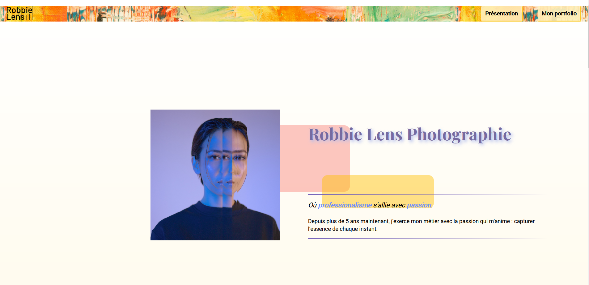

# Robbie Lens website

A **responsive** website designed for a fictional photographer (Robbie Lens).\
Languages used: HTML, CSS, JavaScript.

*Homepage on computer*

*Homepage on smartphone*

This site is inspired from the online free course "Créez votre site web avec HTML5 et CSS3" available on Openclassrooms.\
However, the design is completely original and I add some new ideas, like the price popup or the photos slider on the "a propos" page. This two elements are additionaly coded in JavaScript.
